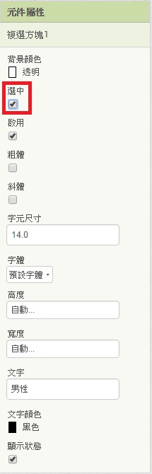
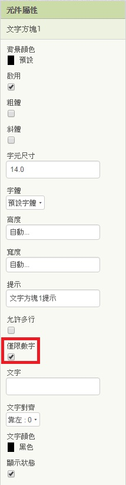
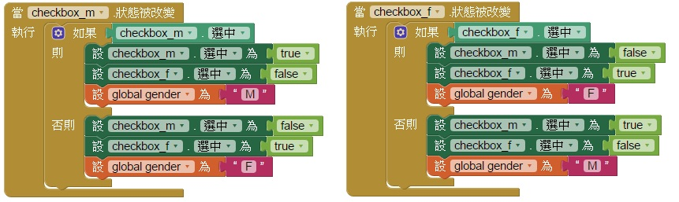
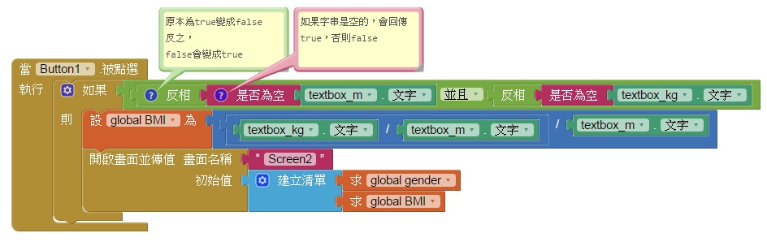
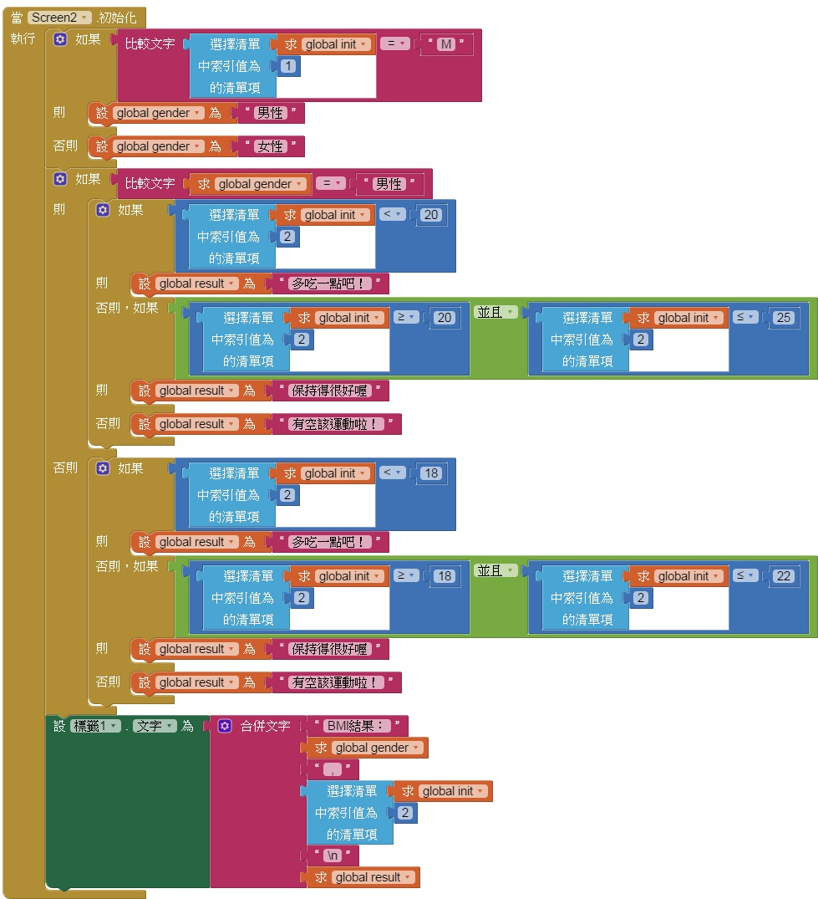

# 101題 => 計算BMI
## 題目要求
* ## 新增一個新畫面(Screen)
* ## 在畫面一加入兩個單選方塊(RadioButton) [inventor只有checkbox(複選方塊)，所以以這個代替]，分別設定成男性及女性
* ## 加入兩個文字方塊(TextBox)，都設定只能輸入數字
* ## 點選計算的按鈕，開啟畫面二，將單選方塊與文字方塊的內容傳送到畫面二，算出BMI值
* ## 在畫面二，以標籤(Label)顯示"BMI結果：性別，BMI數值"，第二行顯示對應字串
* * ## BMI公式 = 體重(kg)/身高(m)/身高(m)。
* * ## 男性標準：20-25；女性標準：18-22
* * ## 對應字串：
<table border="1">
    <th  align="center">計算結果</th>
    <th>對應字串</th>
    <tr  align="center">
        <td>小於標準</td>
        <td>多吃一點吧！</td>
    </tr>
    <tr  align="center">
        <td>介於標準</td>
        <td>保持得很好喔</td>
    </tr>
    <tr  align="center">
        <td>大於標準</td>
        <td>有空該運動啦！</td>
    </tr>
</table>

* ## 畫面二點選回上一頁(按鈕)，可回到畫面一，繼續計算下一筆BMI
---
# 步驟說明
## (1)新增一個新畫面(Screen)

## (2)在畫面一加入兩個單選方塊(RadioButton) [inventor只有checkbox，所以以這個代替]，分別設定成男性及女性
## 這裡建議一開始先將一個"選中"打勾，這樣預設就有一個打勾的。

## (3)加入兩個文字方塊(TextBox)，都設定只能輸入數字

## (4)點選計算的按鈕，開啟畫面二，將單選方塊與文字方塊的內容傳送到畫面二，算出BMI值
### 在做計算之前，我們要先處理複選方塊，如果不處理，複選方塊如果都核取，程式就會有問題，所以要先做判斷，讓他不管怎麼點，都只會有一個被選中。
### 先設定一個變數存性別。

### 接下來就是判斷，如果複選方塊的狀態被改變，如果自己被選中，就把自己勾選並將變數設成對應的值，把另一個取消勾選，否則自己取消，而另一個打勾並設定變數。

### 這裡要先判斷(if)是不是文字方塊都被填寫了，才要將輸入的值送去畫面二，也就是說 當 送出(按鈕)被點下
### 如果 文字方塊1的文字不等於空，而且文字方塊2的文字也不等於空，就開啟畫面二，並傳值。
### 這邊可以在畫面一先把值算好，在傳送至畫面二，會比較方便。
### 所以我們只要 如果 文字方塊都有值 ， 設(變數)為kg/m/m，之後只要傳性別與BMI值到畫面二就可以了。

### 說明：
### 假設輸入"123"，那麼會判斷 123 是不是空的? 不是空的 所以會得到false，但前面的反相，會讓false變成ture 所以會執行。
### 執行後，將BMI(變數)設成體重/身高/身高，並開啟畫面二並傳值。畫面二會收到(性別 BMI值)，這兩個參數。必須使用 選擇清單項取值。
## (5)在畫面二，以標籤(Label)顯示"BMI結果：性別，BMI數值"，第二行顯示對應字串
### 指定變數

### 取得到的初始值為清單，第一項為性別，而第二項為算好的BMI值。
### 當畫面二初始化(程式一開始)，如果第一項(性別)="M"，將gender設為男性，否則為女性，如果性別為男性，就套用男性的標準及字串，若是女性就套用女性的，最後在標籤一顯示結果，使用合併文字。(\n為換行)

## (6)畫面二點選回上一頁(按鈕)，可回到畫面一，繼續計算下一筆BMI
### 當按鈕被點下，關閉頁面，(因為畫面二是在畫面一被開啟，所以畫面一還是存在的，只要關閉畫面二，就可以看到畫面一)。

---
# 評分項目
<table border="1">
    <th  align="center">項目</th>
    <th>配分</th>
    <tr  align="left">
        <td>表單上各物件與參考圖相同，屬性設定正確</td>
        <td>3</td>
    </tr>
    <tr  align="left">
        <td>畫面一的資訊可順利傳送給畫面二，並正確顯示計算結果與建議</td>
        <td>10</td>
    </tr>
    <tr  align="left">
        <td>在畫面二點選回上一頁可返回畫面一</td>
        <td>7</td>
    </tr>
    <tr  align="left">
        <td>總分</td>
        <td>20</td>
    </tr>
</table>