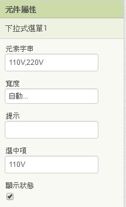
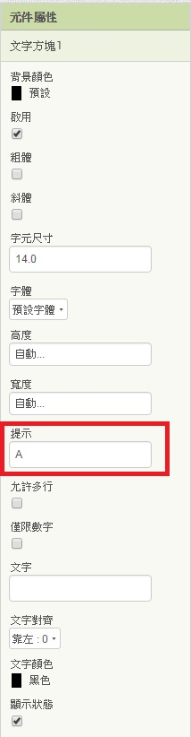
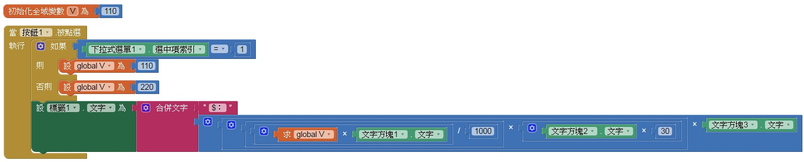

# 102 => 電費計算機
## 題目要求
* ## 在畫面一加入一個下拉選單(Spinner)，內容設定為110V及220V。
* ## 加入三個文字方塊，浮水印(Hint)的部分必須標明為"A"、"hour"、"NT"。
* ## 文字方塊只能輸入數字。
* ## 新增一個按鈕，按鈕名稱為"計算電氣每月電費"，按下後在下方標籤顯示結果。
* * ## 電費公式=((電壓V*電流A)/1000)*(每天使用時數*每月天數30天)*(每度電費)。
---
# 步驟說明
## (1)在畫面一加入一個下拉選單(Spinner)，內容設定為110V及220V。
### 元素字串為選單的內容，以,分隔，先將預設設為其中一個選項。如圖：

## (2)加入三個文字方塊，浮水印(Hint)的部分必須標明為"A"、"hour"、"NT"。
### Hint就是提示的部分

## (3)文字方塊只能輸入數字。

## (4)新增一個按鈕，按鈕名稱為"計算電氣每月電費"，按下後在下方標籤顯示結果。
### 電費公式=((電壓V*電流A)/1000)*(每天使用時數*每月天數30天)*(每度電費)。
### 也就是說，如果按鈕被點選，就套公式算出答案後，放到標籤中顯示。
### 但在套公式前，必須判斷選擇的安培(A)為哪一種，所以我們必須先設定一個變數來存安培數，再帶進公式計算。
### 如果 下拉選單的選中項索引(110V=1,220V=2)=1，則將V=110，否則V=220;

---
# 評分項目
<table border="1">
    <th  align="center">項目</th>
    <th>配分</th>
    <tr  align="left">
        <td>表單上各物件與參考圖相同，屬性設定正確</td>
        <td>4</td>
    </tr>
    <tr  align="left">
        <td>下拉選單提供110V及220V的選擇</td>
        <td>3</td>
    </tr>
    <tr  align="left">
        <td>所有文字方塊只能輸入數字</td>
        <td>3</td>
    </tr>
    <tr  align="left">
        <td>所有文字方塊皆有Hint提示</td>
        <td>3</td>
    </tr>
    <tr  align="left">
        <td>以公式正確計算出結果並於標籤顯示</td>
        <td>7</td>
    </tr>
    <tr  align="left">
        <td>總分</td>
        <td>20</td>
    </tr>
</table>