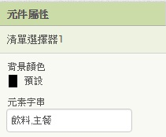
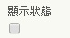
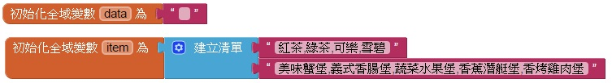
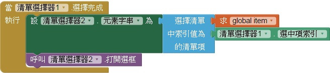
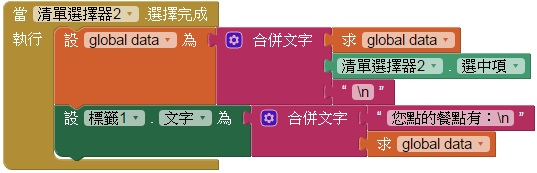
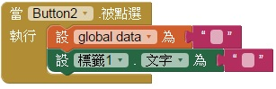

# 104 => 點餐系統
## 題目要求
* ## 在清除(按鈕)左邊新增一個清單選擇器(ListPicker)，文字為"進入點餐系統"，點選後開啟清單，有兩個項目，分別為：飲料、主餐。
* ## 清單設定
* * ## 飲料清單：紅茶、綠茶、可樂、雪碧。
* * ## 主餐清單：美味蟹堡、義式香腸堡、蔬菜水果堡、香蕉潛艇堡、香烤雞肉堡。
## 餐點選擇完畢，跳回主畫面，並更新所點的項目在主畫面，可累加新增。
## 點選清除(按鈕)，清除所有點餐資料。

---
# 步驟說明
## (1)在清除(按鈕)左邊新增一個清單選擇器(ListPicker)，文字為"進入點餐系統"，點選後開啟清單，有兩個項目，分別為：飲料、主餐。
### 元素字串一樣是以,分隔。

## (2)清單設定
### 點選任一種選項，都要出現對應的清單。所以我們先在畫面中放第二個清單選擇器，將它設為不顯示。在元件屬性的最下方，取消勾選就可以了。

### 再來先指定變數存結果和第二個清單要顯示的內容。

### 紅茶...為第一項，美味蟹堡...是第二項，所以說當種類的清單選擇完成之後，要將第二個清單的內容設成對應的內容，而飲料是第一項，剛好對應到第一項。依此類推...並打開第二個選單。
* ### 選中項為選到元素的內容(紅茶,綠茶...)
* ### 選中項索引為選到的元素的編號(1,2,3...)

## (3)餐點選擇完畢，跳回主畫面，並更新所點的項目在主畫面，可累加新增。
### 當第二個選單選擇完畢，把選中項給一個變數之後，並換行，要累加，也就是要先等於自己，在新增新的資料。Ex:abc要累加上de，那麼一定是abc=abc+de而不是abc=de，所以要讓變數=自己+選中項+換行。在標籤上顯示出題目要的格式。如圖：

## (4)點選清除(按鈕)，清除所有點餐資料。
### 當清除被點下，則將變數設為空，也將標籤設為空。

---
# 評分項目
<table border="1">
    <th  align="center">項目</th>
    <th>配分</th>
    <tr  align="left">
        <td>表單上各物件與參考圖相同，屬性設定正確</td>
        <td>4</td>
    </tr>
    <tr  align="left">
        <td>按下"進入點餐系統"按鈕跳出清單，選擇後跳出對應清單</td>
        <td>7</td>
    </tr>
    <tr  align="left">
        <td>選擇飲料，清單正確顯示飲料項目</td>
        <td>3</td>
    </tr>
    <tr  align="left">
        <td>選擇主餐，清單正確顯示主餐項目</td>
        <td>3</td>
    </tr>
    <tr  align="left">
        <td>選擇完畢後，跳回主畫面，並更新所點的項目於主畫面，且可一直累加新增</td>
        <td>2</td>
    </tr>
    <tr  align="left">
        <td>按下清除，可清除目前所有點餐資料</td>
        <td>1</td>
    </tr>
    <tr  align="left">
        <td>總分</td>
        <td>20</td>
    </tr>
</table>