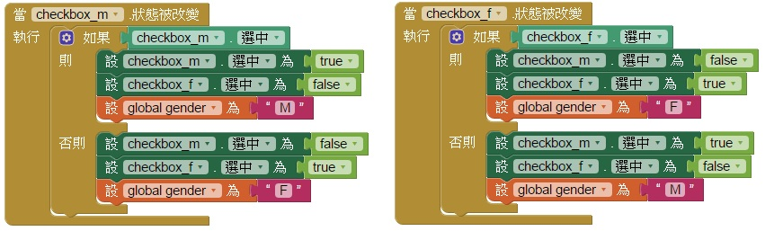

# 106 => 個人基本資料
## 題目要求
* ## 加入五個複選方塊(checkbox)，分別設定性別和興趣的項目
* * ## 性別為：男生、女生，預設男生，單選。
* * ## 興趣為：唱歌、跳舞、看書，可複選。
## 新增一個按鈕(button)，文字為"顯示結果"，按下按鈕後進行資料收集。
## 判斷姓名是否為空，若為空則顯示"姓名：未填寫，如不為空則顯示"姓名:xxx"，將姓名代入xxx中。
## 判斷性別的選取值，顯示"性別：x"，將性別代入x中。
## 判斷興趣欄位的選取值，如有選項被勾選，顯示"興趣：xx,xx,..."，將興趣代入xx中，若完全沒被勾選，則顯示"興趣：未選擇"。
## 資料收集完成後，將資訊以對話框(Notifier)彈出視窗呈現結果，標題為"結果"，按鈕文字為"離開"。
---
# 步驟說明
## (1)加入五個複選方塊(checkbox)，分別設定性別和興趣的項目
### 加入完畢之後，一樣要設成單選，如101一樣：只要把變數的部分修改一下，M=男生；F=女生。

## (2)新增一個按鈕(button)，文字為"顯示結果"，按下按鈕後進行資料收集。
### 當按鈕被點下...
## (3)判斷姓名是否為空，若為空則顯示"姓名：未填寫，如不為空則顯示"姓名:xxx"，將姓名代入xxx中。
### 如果 是否為空(文字方塊的文字)，是的話回傳true否則false，若為空則顯示"姓名：未填寫，如不為空則顯示"姓名:xxx"。(先以變數存著值)

## (4)判斷性別的選取值，顯示"性別：x"，將性別代入x中。(略，上方判斷已經存好變數)
## (5)判斷興趣欄位的選取值，如有選項被勾選，顯示"興趣：xx,xx,..."，將興趣代入xx中，若完全沒被勾選，則顯示"興趣：未選擇"。
### 這邊指定了四個變數，一種興趣一個，若不是被選中，則為空字串，最後以一個變數合併文字，若還是空字串則代表沒選中任何一個興趣，就把變數設成未選擇，否則不變(即合併文字後)。

## (6)資料收集完成後，將資訊以對話框(Notifier)彈出視窗呈現結果，標題為"結果"，按鈕文字為"離開"。
### 直接設定對話框的文字，用合併文字的方式串在一起。

## 整體

---
# 評分項目
<table border="1">
    <th  align="center">項目</th>
    <th>配分</th>
    <tr  align="left">
        <td>表單上各物件與參考圖相同，屬性設定正確</td>
        <td>4</td>
    </tr>
    <tr  align="left">
        <td>設定性別項目為單選</td>
        <td>3</td>
    </tr>
    <tr  align="left">
        <td>設定興趣項目可複選</td>
        <td>3</td>
    </tr>
    <tr  align="left">
        <td>按下"顯示結果"按鈕，正確以對話框彈出視窗顯示結果</td>
        <td>10</td>
    </tr>
    <tr  align="left">
        <td>總分</td>
        <td>20</td>
    </tr>
</table>