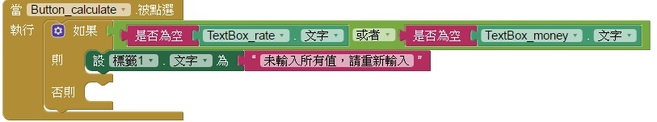
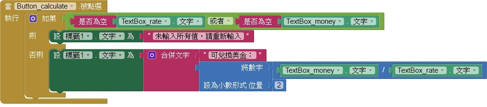

# 108 => 匯率計算
## 題目要求
* ## 設定輸入匯率及金額的文字方塊只能輸入數字。
* ## 在"匯率換算"按鈕下方新增一個標籤，顯示計算結果。
* * ## 計算公式=美金=台幣/匯率
## 點選"匯率換算"按鈕，依照公式進行台幣與美金的兌換，換算後顯示至小數點第二位，並在標籤顯示"可兌換美金:xx.xx"。
## 若其中一個未輸入就按下按鈕，則在標籤顯示"未輸入所有值，請重新輸入"。
---
# 步驟說明
## (1)設定輸入匯率及金額的文字方塊只能輸入數字。

## (4)若其中一個未輸入就按下按鈕，則在標籤顯示"未輸入所有值，請重新輸入"。
### 當按鈕被按下，如果文字方塊1或文字方塊2是空的，就在標籤顯示"未輸入所有值，請重新輸入"，否則依照公式計算。

## (2)在"匯率換算"按鈕下方新增一個標籤，顯示計算結果。
## (3)點選"匯率換算"按鈕，依照公式進行台幣與美金的兌換，換算後顯示至小數點第二位，並在標籤顯示"可兌換美金:xx.xx"。
### 如果都有填寫，則將標籤的文字設為"可兌換美金"和公式算出來的結果，並取到小數第二位。

---
# 評分項目
<table border="1">
    <th  align="center">項目</th>
    <th>配分</th>
    <tr  align="left">
        <td>表單上各物件與參考圖相同，屬性設定正確</td>
        <td>3</td>
    </tr>
    <tr  align="left">
        <td>匯率及台幣的文字方塊只能輸入數字</td>
        <td>2</td>
    </tr>
    <tr  align="left">
        <td>按下"匯率換算"按鈕，正確顯示結果</td>
        <td>12</td>
    </tr>
    <tr  align="left">
        <td>若未輸入完整資料按下換算，於標籤顯示"未輸入所有值，請重新輸入"</td>
        <td>3</td>
    </tr>
    <tr  align="left">
        <td>總分</td>
        <td>20</td>
    </tr>
</table>